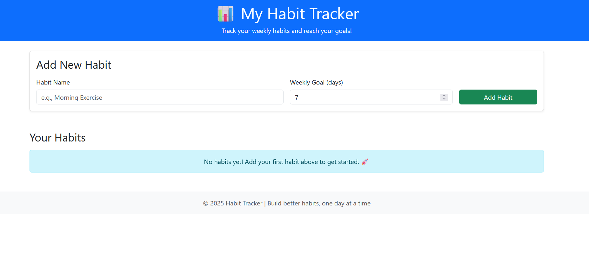
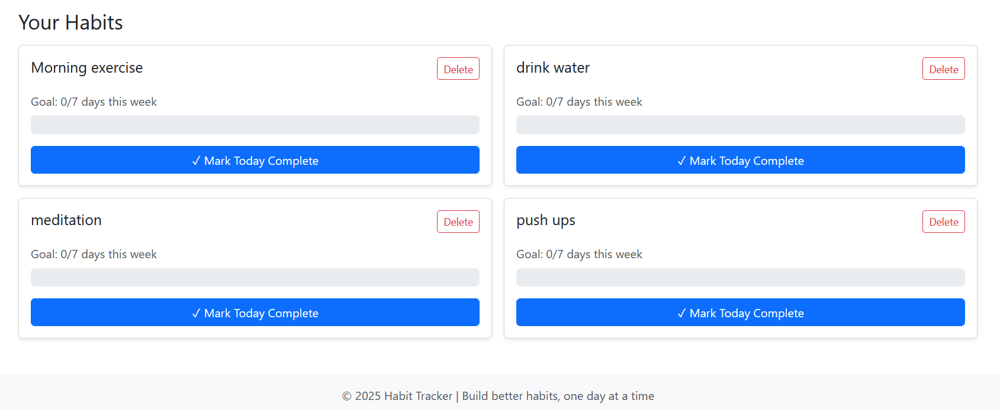

# 📊 Habit Tracker

A simple and elegant web application to track your daily habits and achieve your weekly goals. Built with Flask, Bootstrap, and jQuery.

## 🌟 Features

- **Add Custom Habits**: Create habits with personalized weekly goals (1-7 days)
- **Visual Progress Tracking**: Animated progress bars showing completion percentage
- **Daily Logging**: Mark habits as complete for the current day
- **Weekly Overview**: Track your progress over the last 7 days
- **Delete Habits**: Remove habits you no longer want to track
- **Responsive Design**: Works seamlessly on desktop and mobile devices
- **Form Validation**: Client-side validation using jQuery
- **Beautiful UI**: Modern gradient design with smooth animations

## 🛠️ Technologies Used

- **Backend**: Flask (Python web framework)
- **Frontend**: HTML5, Bootstrap 5
- **Styling**: Custom CSS with gradients and animations
- **JavaScript**: jQuery for DOM manipulation and validation
- **Database**: SQLite (lightweight, file-based database)

## 📁 Project Structure

```
habit-tracker/
│
├── static/
│   ├── style.css          # Custom CSS styling
│   └── script.js          # jQuery validation and effects
│
├── templates/
│   ├── index.html         # Main dashboard page
│   └── success.html       # Success confirmation page
│
├── app.py                 # Flask application (main file)
├── requirements.txt       # Python dependencies
├── habits.db             # SQLite database (auto-generated)
└── README.md             # Project documentation
```

## 🚀 Setup Instructions

### Prerequisites
- Python 3.7 or higher
- pip (Python package manager)
- Git

### Installation Steps

1. **Clone the repository**
   ```bash
   git clone https://github.com/Valamala/habit-tracker.git
   cd habit-tracker
   ```

2. **Create a virtual environment** (recommended)
   ```bash
   python -m venv venv
   
   # On Windows:
   venv\Scripts\activate
   
   # On macOS/Linux:
   source venv/bin/activate
   ```

3. **Install dependencies**
   ```bash
   pip install -r requirements.txt
   ```

4. **Run the application**
   ```bash
   python app.py
   ```

5. **Open in browser**
   - Navigate to `http://127.0.0.1:5000/`
   - Start tracking your habits!

## 📖 How to Use

1. **Add a New Habit**
   - Enter the habit name (e.g., "Morning Exercise")
   - Set your weekly goal (1-7 days)
   - Click "Add Habit"

2. **Track Your Progress**
   - View all your habits on the dashboard
   - See progress bars showing completion percentage
   - Check how many days you've completed vs your goal

3. **Mark Daily Completion**
   - Click "Mark Today Complete" button on any habit
   - The progress bar updates automatically
   - You can toggle completion for the current day

4. **Delete Habits**
   - Click the "Delete" button on any habit card
   - Confirm deletion in the popup

## 🎯 Features Breakdown

### Form Validation
- Habit name must be at least 3 characters
- Weekly goal must be between 1-7 days
- Real-time validation feedback
- Custom error messages

### Progress Calculation
- Tracks completion over the last 7 days
- Calculates percentage based on weekly goal
- Visual progress bars with animations
- Color-coded (blue for in-progress, green for 100%)

### Database Schema

**Habits Table**
- id (PRIMARY KEY)
- name (TEXT)
- goal (INTEGER)
- created_date (TEXT)

**Habit Logs Table**
- id (PRIMARY KEY)
- habit_id (FOREIGN KEY)
- log_date (TEXT)
- completed (INTEGER, 0 or 1)

## 🎨 Screenshots


*Main dashboard showing habit cards with progress bars*


*Form to add new habits with validation*

## 🔄 Git Workflow

```bash
# Initialize repository
git init

# Add all files
git add .

# Commit changes
git commit -m "Initial commit: Habit Tracker application"

# Add remote repository
git remote add origin https://github.com/Valamala/habit-tracker.git

# Push to GitHub
git push -u origin main


**Happy Habit Tracking! 🎉**
